# Архитектура проекта Legal NLP

Документация архитектуры системы для работы с российским законодательством.

## Общая архитектура системы

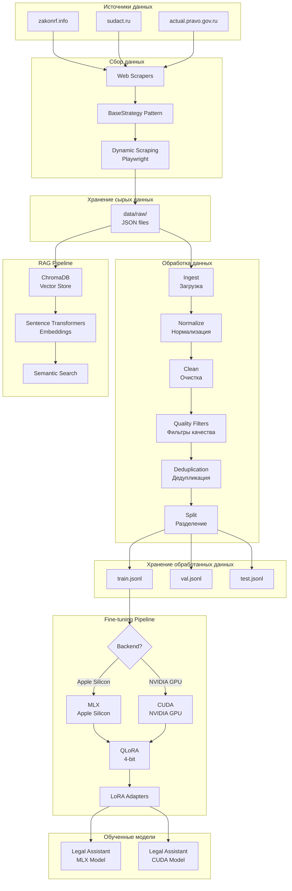

## Pipeline предобработки данных

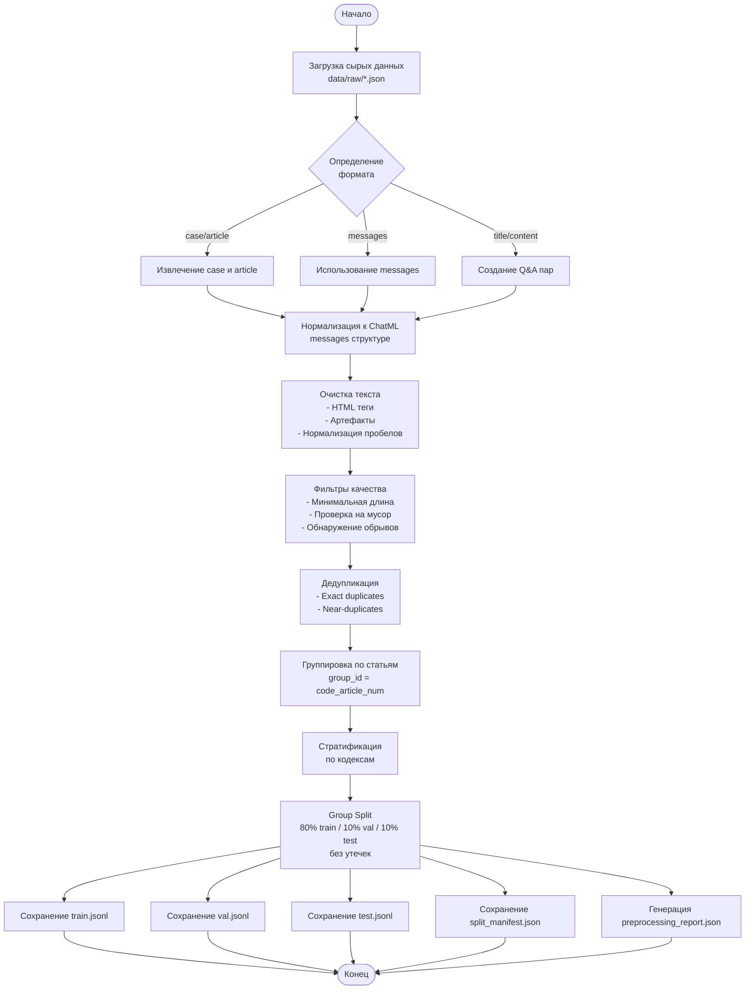

## RAG System Architecture

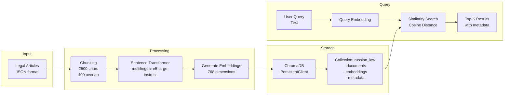

## Fine-tuning Pipeline

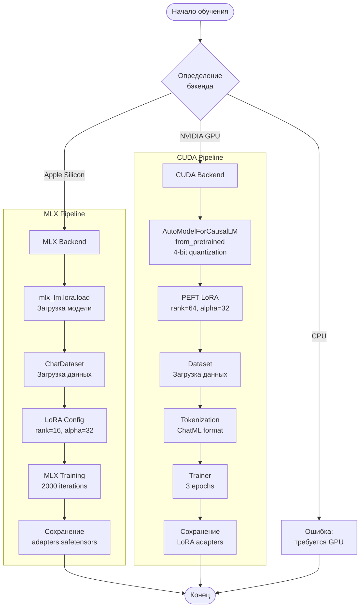

## Компоненты системы

### 1. Web Scrapers

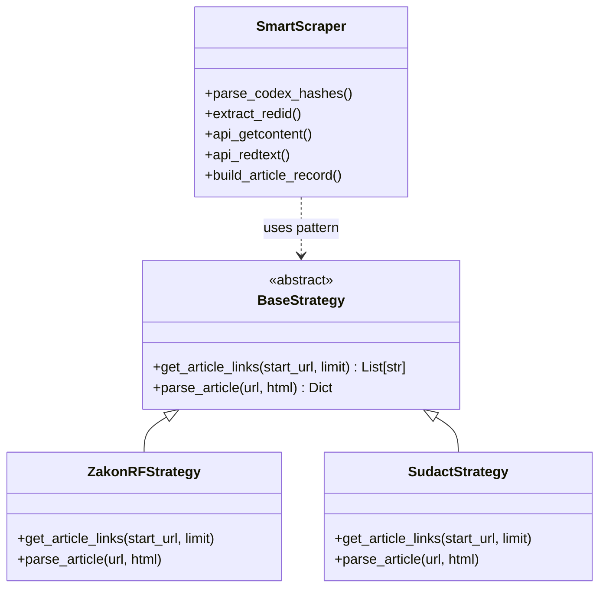

### 2. Data Preprocessing

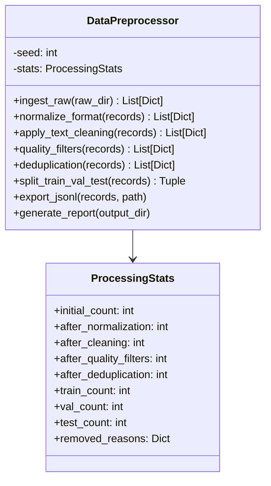

### 3. RAG System

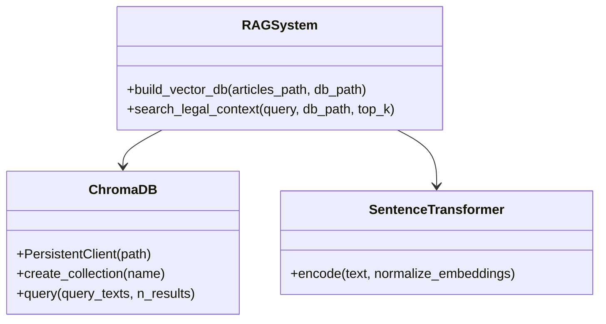

### 4. Fine-tuning System

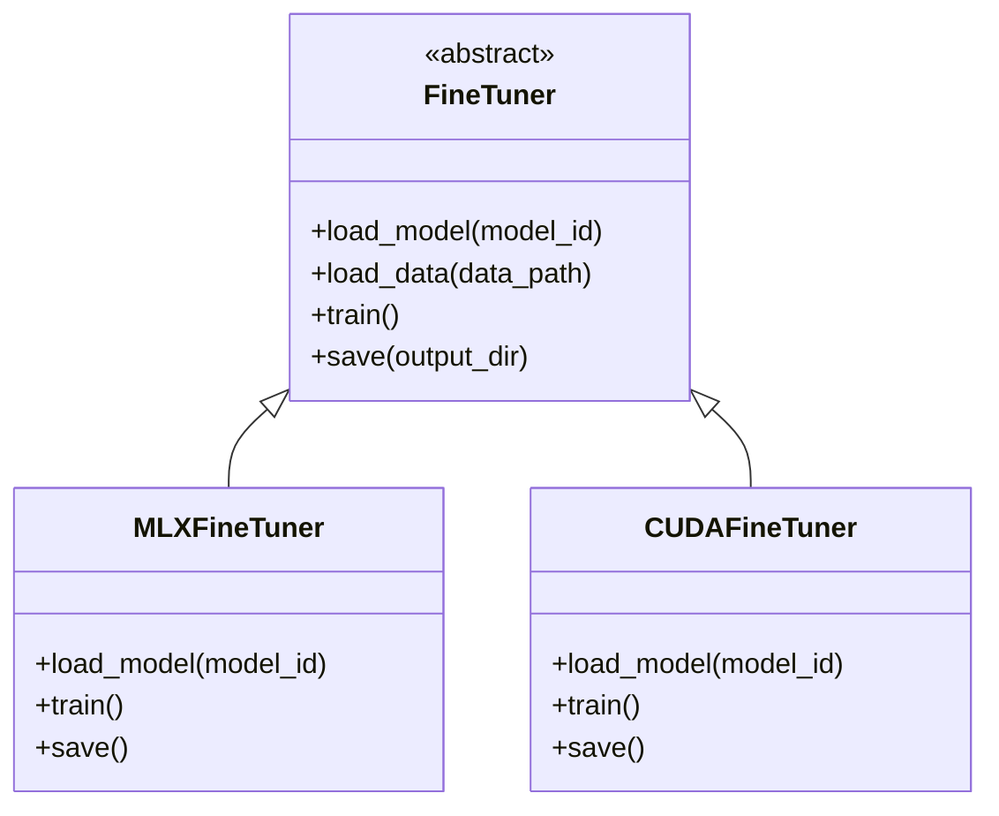

## Потоки данных

### Поток 1: Сбор и обработка данных

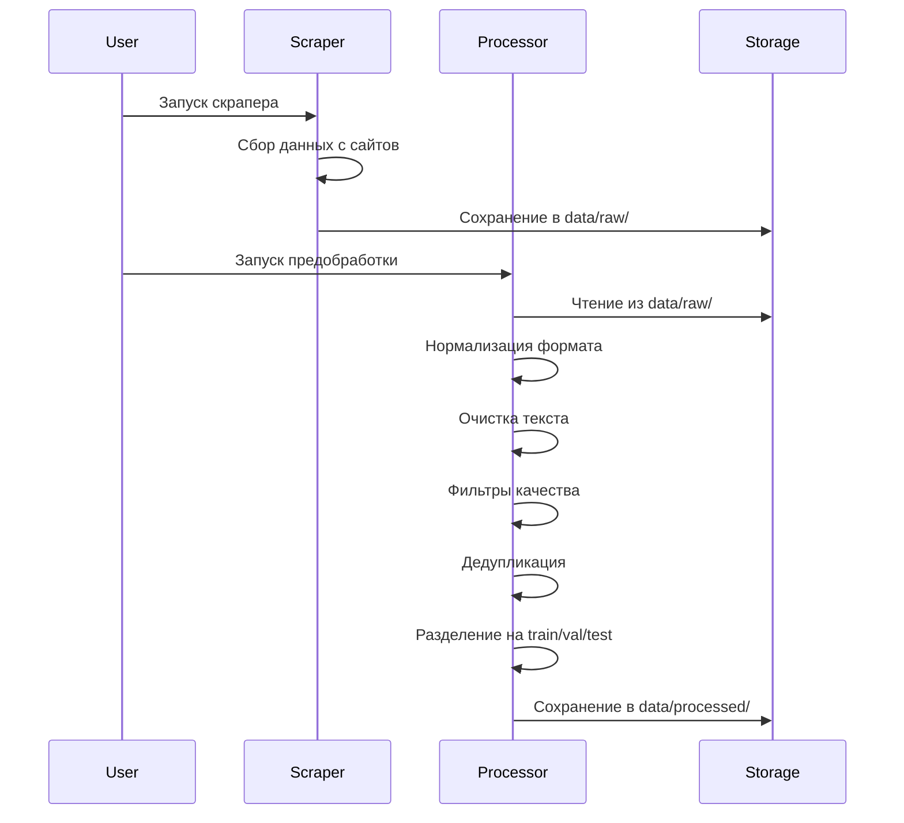

### Поток 2: Построение RAG системы

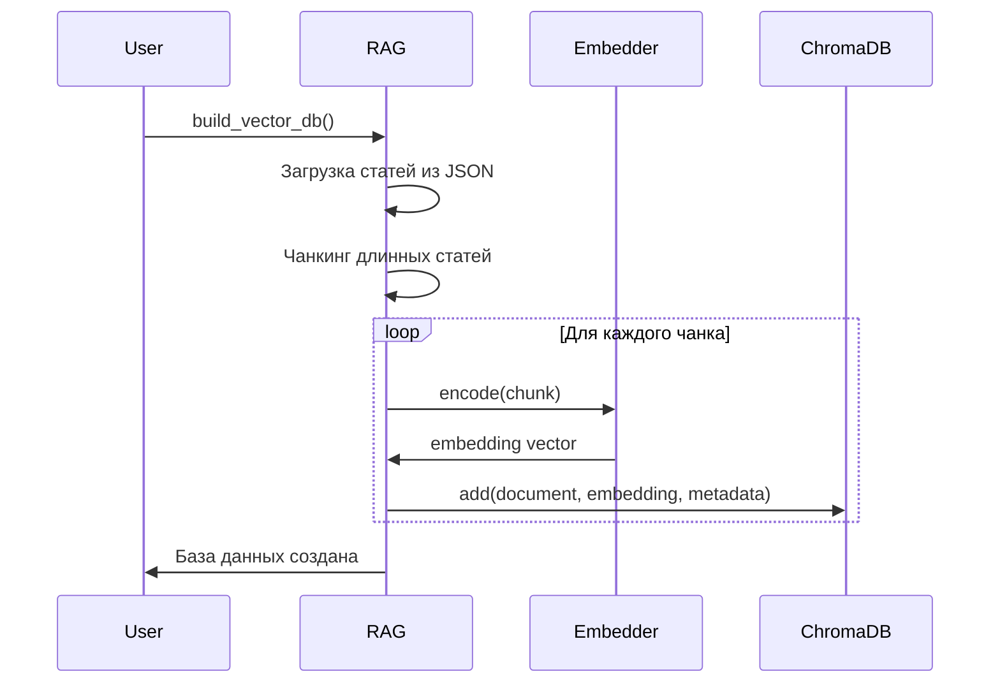

### Поток 3: Поиск в RAG системе

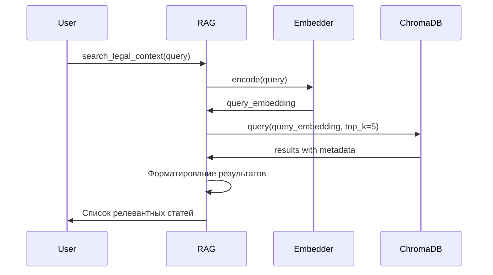

### Поток 4: Fine-tuning

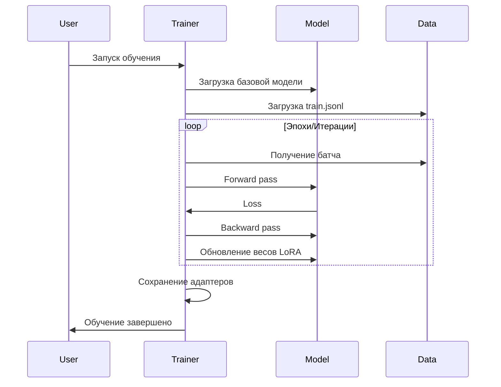

## Структура данных

### Формат входных данных (сырые)

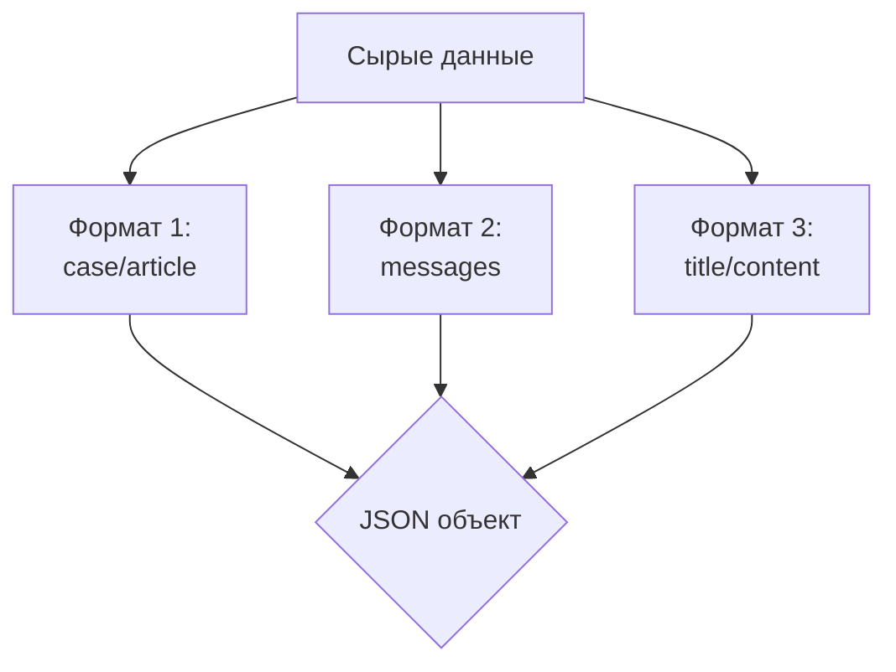

### Формат выходных данных (для обучения)

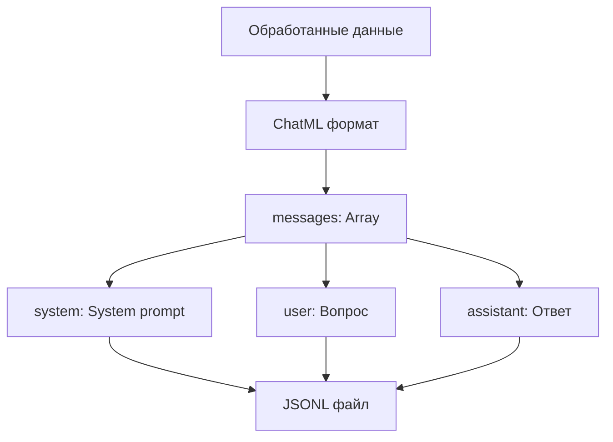

## Метаданные и конфигурация

### Метаданные статей в RAG

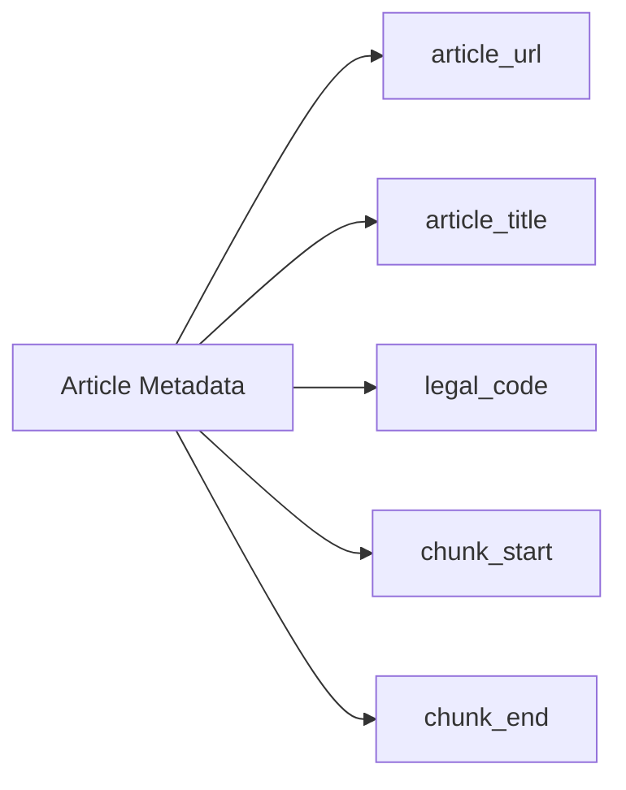

### Конфигурация LoRA

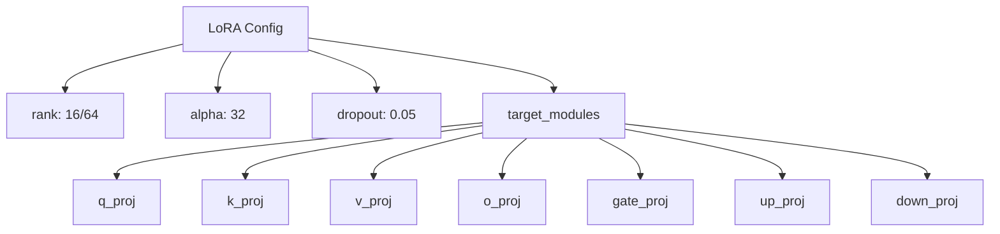

## Масштабирование и производительность

### Стратегии оптимизации

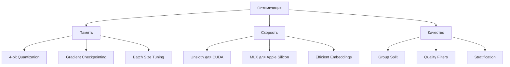

---

**Версия документа**: 1.0  
**Последнее обновление**: 2024

